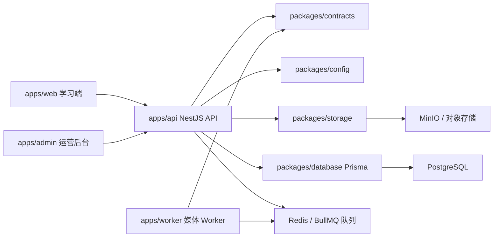

# EchoFlow 架构说明

> 状态说明：本文主要描述产品代码审计源点 `42968ad` 的工程骨架，不代表 V1 目标已经实现。目标架构和已确认边界见 [EchoFlow V1 PRD](EchoFlow-V1-PRD.md)，当前执行状态见 [Execution State](EXECUTION-STATE.md)。

更新时间：2026-07-18

## 总览

EchoFlow 使用 pnpm monorepo 管理前端、后台、API、Worker 和共享包。当前重点是学习端体验与可运行的后端骨架，数据层、存储层和异步处理层已经建立开发期接口。



## 前端

`apps/web` 是学习端，当前包含课程库、发现、收藏、练习页、录音 Hook、字幕解析工具和个人上传入口。样式已从单一 `styles.css` 拆分为 `base`、`layout`、`library`、`study`、`uploads`、`responsive` 模块。

`apps/admin` 是运营后台骨架，展示候选内容、授权审核、字幕校对、任务处理和发布流程的核心信息结构。

## 后端

`apps/api` 使用 NestJS 模块拆分业务边界：

- `auth`：开发验证码登录。
- `videos` / `lessons`：课程列表与课程详情。
- `subtitles`：字幕读取与单句更新。
- `progress`：学习进度读取与更新。
- `uploads` / `jobs`：私有上传预签名与处理任务。
- `admin`：候选内容、授权审核和发布操作。

## 异步处理

`apps/worker` 通过 BullMQ 消费 `online-learning-media` 队列。当前实现为幂等的媒体处理骨架，可模拟 `transcode`、`transcribe`、`translate`、`segment`、`publish` 阶段。

## 数据与存储

`packages/database` 定义 PostgreSQL Prisma schema，覆盖用户、视频资产、课程、字幕、进度、收藏、生词、录音、上传和处理任务。

`packages/storage` 提供 `StorageProvider` 接口，当前有内存实现和 MinIO 实现。上传目标包含 `objectKey`、`uploadUrl` 和 `expiresAt`。

## 验证状态

当前已通过：

```powershell
pnpm lint
pnpm test
pnpm build
```
