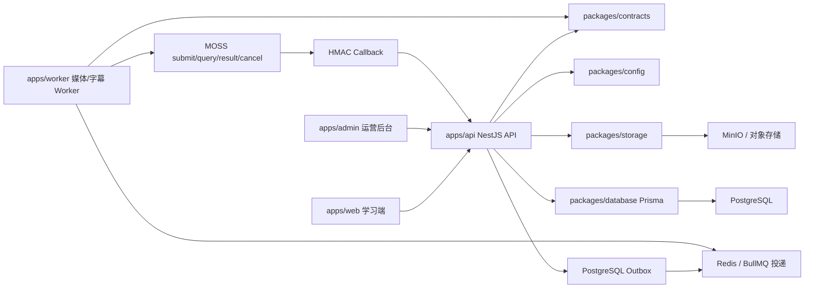

# EchoFlow 架构说明

> 状态说明：本文区分 G1/G2 已关闭能力、G3 当前实施能力和仍冻结的 G4–G5。目标架构和已确认边界见 [EchoFlow V1 PRD](EchoFlow-V1-PRD.md)，动态进度见 [Execution State](EXECUTION-STATE.md)。

更新时间：2026-08-13

## 总览

EchoFlow 使用 pnpm monorepo 管理前端、后台、API、Worker 和共享包。当前重点是学习端体验与可运行的后端骨架，数据层、存储层和异步处理层已经建立开发期接口。



## 前端

`apps/web` 的 V1 可达路径已接通 OTP、私人 Multipart 上传、真实原片播放、字幕持久阶段/分片计数和当前 ACTIVE 完整字幕查看。逐句循环、录音回听与服务端进度仍属于 G4；词典、生词、公共课程等旧原型不计入 V1 验收。

`apps/admin` 是运营后台骨架，展示候选内容、授权审核、字幕校对、任务处理和发布流程的核心信息结构。

## 后端

`apps/api` 使用 `/api/v1`，当前挂载：

- `health`：存活与 PostgreSQL readiness；
- `auth`：随机 OTP 的可替换发送端口、短期 Access JWT、opaque rotating Refresh Session；
- `users`：当前用户；
- `uploads/media-assets`：私人 Multipart、对象事实、签名 Range 播放与字幕状态/ACTIVE 版本；
- `integrations/moss/callback`：原始请求体 HMAC、持久 Event/Nonce 防重放与 Outbox 唤醒；
- `lessons`：数据库 owner 条件下的私人 Lesson 最小读取；
- `admin`：RBAC 保护的最小审计列表。

回调入口不共享用户身份，但使用独立 HMAC 信任边界；所有私人读取仍由 owner 条件限制。旧公共内容、字幕编辑与内存任务原型没有进入 V1 生产入口。

## 异步处理

`apps/worker` 通过 BullMQ 消费 `echoflow-media` 队列，PostgreSQL Run/Chunk/Outbox 是事实源。G2 Worker 真实探测 MP4/H.264/AAC 并按需做无损 fast-start；G3 Worker 从 0ms 提取 16 kHz 单声道音频、在静音附近切片、通过 Adapter 调用 MOSS，以 Callback 为主且轮询兜底，保存不可变原始结果，合并逐词时间戳并在单事务中发布唯一 ACTIVE 字幕。

Run/Chunk 采用 lease/CAS 与最终 fencing；旧 Worker 在提交分片、拉取结果和发布前都必须重新证明当前租约。外部任务 ID、幂等键、回调时间、取消状态和对象版本均持久化，部署时模型配置变化不会改写既有 Chunk 的模型来源。

所有 G3 临时对象都先在 PostgreSQL 预留 `PENDING` 身份和预期 checksum/大小，再执行对象存储写入；响应丢失或进程崩溃后，接管 Worker 按稳定 object key 恢复并转为 `READY`，清理器始终有可扫描的数据库身份。Redis 丢消息由恢复扫描重建；失败只重试所需阶段或分片。Fake MOSS 只用于确定性故障测试，不是生产替代品。

## 数据与存储

`packages/database` 的 V1 baseline 覆盖身份会话、上传、媒体对象、处理运行/分片、Outbox、字幕版本、私人 Lesson、学习单元与进度、审计和幂等记录。数据库使用复合外键约束 owner/聚合一致性，不包含收藏、生词、翻译、公共发布或云端录音。

`packages/storage` 的生产路径为私有 MinIO/S3 Multipart 与短期签名读写。视频、规范化音频、音频分片和 MOSS 原始结果在对象存储；PostgreSQL 保存对象 Version/ETag/checksum、处理状态和结构化最终字幕。MOSS 只得到临时音频 URL，不得到永久对象存储凭据。

## 验证状态

当前本地实现已通过定向 TypeScript、单元测试、真实 PostgreSQL/MinIO/Redis/FFmpeg 集成和生产构建；其中 Fake MOSS 已覆盖成功、单片失败后定向恢复、提交/完成与取消竞态、租约接管、对象写入响应丢失、checksum 损坏、发布事务回滚、队列重建和清理。G3 尚缺真实 MOSS endpoint/协议和 30 秒及 5/30/60/120 分钟真实矩阵，因此当前验证不能关闭 G3。

常用全仓门禁：

```powershell
pnpm lint
pnpm test
pnpm build
```
