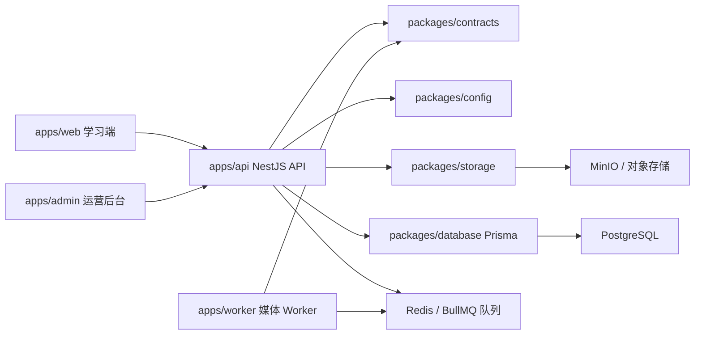

# EchoFlow 架构说明

> 状态说明：本文区分 G1 已接通的身份/数据库基线和仍未接通的 G2–G5 能力。目标架构和已确认边界见 [EchoFlow V1 PRD](EchoFlow-V1-PRD.md)，动态进度见 [Execution State](EXECUTION-STATE.md)。

更新时间：2026-08-12

## 总览

EchoFlow 使用 pnpm monorepo 管理前端、后台、API、Worker 和共享包。当前重点是学习端体验与可运行的后端骨架，数据层、存储层和异步处理层已经建立开发期接口。



## 前端

`apps/web` 是学习端，当前包含课程库、发现、收藏、练习页、录音 Hook、字幕解析工具和个人上传入口。样式已从单一 `styles.css` 拆分为 `base`、`layout`、`library`、`study`、`uploads`、`responsive` 模块。

`apps/admin` 是运营后台骨架，展示候选内容、授权审核、字幕校对、任务处理和发布流程的核心信息结构。

## 后端

`apps/api` 的 G1 生产入口使用 `/api/v1`，当前只挂载：

- `health`：存活与 PostgreSQL readiness；
- `auth`：随机 OTP 的可替换发送端口、短期 Access JWT、opaque rotating Refresh Session；
- `users`：当前用户；
- `lessons`：数据库 owner 条件下的私人 Lesson 最小读取；
- `admin`：RBAC 保护的最小审计列表。

旧 `videos/subtitles/progress/uploads/jobs` 原型源码尚待所属 Gate 清理，但没有被 `AppModule` 挂载，不能作为当前能力使用。

## 异步处理

`apps/worker` 通过 BullMQ 消费 `online-learning-media` 队列。当前实现为幂等的媒体处理骨架，可模拟 `transcode`、`transcribe`、`translate`、`segment`、`publish` 阶段。

## 数据与存储

`packages/database` 的 V1 baseline 覆盖身份会话、上传、媒体对象、处理运行/分片、Outbox、字幕版本、私人 Lesson、学习单元与进度、审计和幂等记录。数据库使用复合外键约束 owner/聚合一致性，不包含收藏、生词、翻译、公共发布或云端录音。

`packages/storage` 提供 `StorageProvider` 接口，当前有内存实现和 MinIO 实现。上传目标包含 `objectKey`、`uploadUrl` 和 `expiresAt`。

## 验证状态

当前已通过：

```powershell
pnpm lint
pnpm test
pnpm build
```
