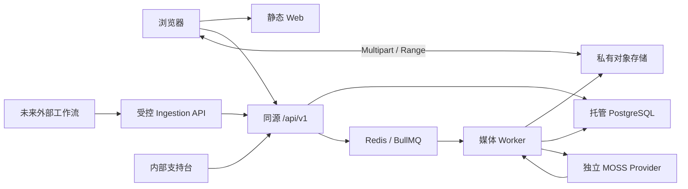

# EchoFlow V1 总复盘与实施蓝图

> 本文不是构想清单，而是 EchoFlow V1 后续设计、开发、测试和上线的唯一决策基线。旧文档仍保留审计价值；当旧方案与本文冲突时，以本文为准。

## 一、执行结论

EchoFlow 当前最准确的状态仍是：

> 已形成视觉完整度较高的产品原型和合理的 Monorepo 骨架，但真实上传、自动字幕、私人数据和学习闭环尚未在唯一主线上形成可发布产品。

经过逐项确认，V1 已经从“公共课程平台 + 多种学习功能”的宽泛设想收敛为：

> **面向英语口语学习者的私人长视频影子练习工具。用户上传自己的英语视频，系统自动生成完整英文字幕，再将长视频组织为可逐句循环、录音回听和恢复进度的私人学习内容。**

V1 的主路径只有一条：

```text
受邀登录
→ 上传私人英语长视频
→ 上传完成后播放原视频
→ 后台生成完整英文字幕
→ 创建 5–10 分钟学习单元
→ 逐句听原声、录音、回听、重练
→ 离开后可靠恢复
```

第一版不追求功能数量，而追求这条路径真实、稳定、安全、无明显 Bug。

### 当前资产与目标产品之间的差距

| 维度 | 当前 master 现实 | V1 目标 |
|---|---|---|
| 视觉 | 学习端和管理端可用于展示 | 保留设计语言，删掉无行为入口 |
| 内容 | 静态课程与全局样例 Cue | 每个私人视频有自己的媒体与字幕版本 |
| 播放 | 主要是封面和模拟语音 | 真实 HTML 视频、Range、真实时间轴 |
| 上传 | 静态界面和模拟进度 | 对象存储 Multipart、7 天续传、真实校验 |
| API | 硬编码和进程内状态较多 | `/api/v1`、PostgreSQL、owner scope |
| Worker | 模拟阶段 | 可恢复、幂等的真实媒体流水线 |
| MOSS | 有分支成果但未形成主线契约 | 可替换 ASR Provider，只承担转写 |
| 权限 | 当前接口不适合公网 | 默认鉴权、私人对象、管理员最小权限 |
| 测试 | 现有测试验证原型较多 | 覆盖上传—字幕—练习真实闭环 |
| 发布 | 无唯一远程和可靠生产链路 | 单一 trunk、CI、可恢复发布与回滚 |

不再使用一个“完成度百分比”概括项目，因为用户价值是一条乘法链：上传、媒体真实性、字幕准确性、练习控制、录音比较、状态恢复和用户信任中，任何一项为零，最终价值都接近零。

### 与旧草案相比，本次真正冻结的变化

| 旧草案倾向 | 已确认的 V1 |
|---|---|
| 公共课程库是产品中心 | “我的视频”是产品中心 |
| 精选课程与个人上传同时推进 | 先把个人私人上传做完整 |
| 上传是后续扩展 | 上传是 V1 内容入口和主链路起点 |
| 短视频或演示素材优先 | 稳定验收 120 分钟长播客视频 |
| 可由用户手工提供字幕 | 不做手动字幕，依赖 MOSS 自动英文转写 |
| 可边生成边学习 | 完整字幕通过校验后原子发布，不开放部分字幕学习 |
| 多种学习辅助并行建设 | 只保留真实播放、逐句练习、最新录音和进度恢复 |
| 管理端承担内容审核发布 | 管理端只做内部任务支持和审计 |
| 工作流直接导入数据库 | 工作流未来调用统一 Ingestion API，禁止直写数据库 |

---

## 二、第一性原理：用户真正需要什么

用户不是来购买课程卡片、任务百分比、管理仪表盘或 AI 标签。用户真正要完成的变化是：

> 把原本只能被动观看的一段英语内容，变成低摩擦、可重复、可比较、可继续的口语练习。

普通播放器的主要阻力是：

- 很难准确反复定位一句话；
- 长播客不适合一次练完；
- 视频、字幕、录音和进度分散在多个工具；
- 用户不愿手工制作字幕；
- 离开后难以准确继续；
- 原声与自己的表达缺少同一上下文中的比较。

因此 EchoFlow 的最小价值单位不是“完成一门课程”，而是一次合格练习循环：

```text
播放真实原声 Cue
→ 用户录制自己的表达
→ 回听自己的录音
→ 再听原声或重新录制
→ 保存这次练习的位置与结果
```

V1 可以观察这个行为，但不能把它包装成“掌握”、发音分或口语提升值。

### 产品价值链


---

## 三、目标用户与产品边界

### 3.1 用户优先级

| 优先级 | 用户 | V1 满足什么 | V1 不承诺什么 |
|---|---|---|---|
| 核心 | 有英语口语需求的大学生和成年学习者 | 模仿真实表达、节奏、连读，完成跟读比较 | 自动证明口语提升 |
| 第二 | 四六级学习者 | 上传听力或复习材料并分段跟读 | 题库、模考、自动判题 |
| 第三 | 雅思学习者 | 上传访谈、播客和口语材料逐句练习 | 雅思评分、预测题、专用考试流程 |

V1 封闭测试默认邀请制、18 岁以上、私人使用。

### 3.2 一句话价值主张

> 把你自己的英语长视频，自动变成可以逐句影子练习的私人课程。

### 3.3 V1 必做

- 邀请用户登录和会话恢复；
- 私人长视频上传；
- MP4 / H.264 / AAC；
- 稳定验收 120 分钟，架构支持 3 小时、8 GiB；
- 原始清晰度保存；
- 上传完成后真实播放；
- MOSS 自动生成完整英文字幕；
- 5–10 分钟学习单元；
- 连续播放和逐句练习两种模式；
- 当前 Cue 高亮、点击定位、上一句、重听、下一句、单句循环和倍速；
- 每个 Cue 在本设备保存最新一条录音；
- 原声与录音回听；
- 服务端学习进度和刷新恢复；
- 桌面与移动端完整主流程；
- 私人资源隔离、删除和错误恢复；
- 最小内部任务支持台。

### 3.4 V1 明确不做

- 公共课程市场和公开视频分享；
- 收藏、每日目标、连续打卡、排行榜、社交和评论；
- 四六级或雅思题库、模考和预测；
- 手动 SRT/VTT 上传或字幕编辑器；
- 中文翻译、双语字幕和说话人识别；
- AI 发音评分、自动纠音和“掌握度”；
- 生词本、词典、笔记；
- 多文件批量上传；
- 多档清晰度和 HLS；
- 任意 A–B 区间编辑器；
- 多条录音历史和云端录音；
- 工作流导入 UI；
- 公开内容审核和发布；
- 支付、订阅、推荐算法和增长系统；
- Kubernetes、多地域和复杂微服务。

这些能力不是永远不做，而是不能占用 V1 核心闭环资源。

---

## 四、信息架构与页面范围

### 4.1 学习端结构

```text
未登录
└─ 登录

已登录
├─ 首页
│  ├─ 继续学习
│  ├─ 当前上传/处理
│  └─ 最近视频
├─ 我的视频
│  ├─ 搜索和状态筛选
│  ├─ 视频详情
│  ├─ 上传新视频
│  └─ 上传/处理任务
├─ 学习播放器
│  ├─ 学习单元
│  ├─ 视频与英文字幕
│  ├─ 句子控制
│  └─ 录音回听
├─ 学习记录
└─ 我的/设置
   ├─ 账号
   ├─ 播放偏好
   ├─ 本地录音与存储
   ├─ 隐私和删除
   └─ 退出登录
```

建议路由：

```text
/login
/
/my/videos
/my/videos/:videoId
/uploads/new
/uploads/:uploadId
/learn/:videoId
/history
/me
/settings
/403
/404
```

移动端底部导航：

```text
首页｜我的视频｜上传｜学习记录｜我的
```

播放器和上传详情可以隐藏底部导航，但必须保留明确返回入口。

### 4.2 页面真实性规则

每个数据页面必须具备：Loading、Empty、Error、Normal、Disabled、Success。

全局要求：

1. 空状态不能用模拟课程填充；
2. 所有进度都来自真实状态；
3. 没有行为的按钮不展示；
4. 禁用按钮说明原因；
5. 错误提供下一步操作；
6. URL 可以深链，刷新不回首页；
7. 状态不能只依赖颜色；
8. 危险操作需要确认；
9. 图标按钮有可访问名称；
10. 登录后返回原访问位置。

### 4.3 最小内部管理台

管理端 V1 只承担支持和排障：

- 系统概览；
- ProcessingRun 和分片状态；
- 媒体元数据、错误码和处理版本；
- 重试、取消等受控操作；
- 审计事件。

管理员默认不能播放或下载用户私人视频，也不建设候选内容、字幕校对和公共发布功能。所有管理动作必须审计。

---

## 五、端到端用户旅程

### 5.1 上传

```text
登录
→ 打开“上传视频”完整页面
→ 选择文件
→ 本地检查容器、编码、大小和时长
→ 展示文件信息与私人说明
→ 用户确认有权处理该内容
→ 创建 UploadSession
→ 浏览器直传对象存储
```

上传规则：

- 每位用户同时一个活动上传；
- 使用 Multipart Upload，字节不经过 API；
- 分片大小和并发配置化，初始建议约 32 MiB、并发 3；
- `uploadId`、文件指纹、已完成分片和 ETag 存入 IndexedDB；
- 断网自动暂停，恢复网络后继续；
- 浏览器关闭后不承诺后台继续；
- 重新打开并选择同一文件后，只补传缺失分片；
- 续传窗口 7 天，第 8 天终止未完成 Multipart；
- 签名过期只重新签发缺失分片；
- `complete` 幂等，服务端重新读取真实 Part Manifest；
- 完成后执行对象大小、版本、校验值和媒体探测；
- 失败文件不能进入处理链路；
- 取消后撤销任务并清理临时分片。

合规格式以 UI 和服务端统一契约为准：MP4、H.264、AAC；V1 稳定验收 5、30、60、120 分钟样本，至少一次验证 3 小时、8 GiB 架构上限。

### 5.2 上传后的视频与字幕

上传和字幕是两个独立状态：

```text
UploadSession: CREATED → UPLOADING → VERIFYING → COMPLETED
MediaAsset:    PROCESSING_PLAYBACK → PLAYABLE
ProcessingRun: QUEUED → PROCESSING → VALIDATING → SUCCEEDED/FAILED/CANCELLED
```

上传校验通过后：

- 兼容媒体直接播放；
- 若 MP4 不适合渐进播放，只做 fast-start remux；
- V1 不为了统一格式而对合规原片做有损转码；
- 字幕失败不影响原视频播放；
- 练习入口要等完整英文字幕发布后才开放。

**V1 不开放“部分字幕先学”。** 全部分片完成、合并、验证成功后，完整字幕在一个事务中原子发布。UI 可以展示真实阶段，但无可信分母时不显示虚假百分比。

### 5.3 学习

长视频不会复制切割为多份视频，而是使用同一媒体上的绝对时间范围形成 5–10 分钟学习单元。

```text
打开私人视频
→ 选择学习单元
→ 连续模式观看
→ 切换逐句模式
→ 播放当前 Cue
→ 录音
→ 回听自己的录音
→ 再听原声或重录
→ 保存进度
```

播放器要求：

- 使用真实 `HTMLVideoElement`；
- `video.currentTime` 是字幕、跳转和循环的唯一时钟；
- HTTP Range 播放；
- 播放、暂停、拖动、音量、全屏；
- 0.5×、0.75×、1×、1.25×、1.5×；
- 英文字幕显示/隐藏、当前 Cue 高亮、点击字幕定位；
- 连续模式和逐句模式；
- 上一句、重听、下一句、单句循环；
- 签名播放地址过期后保存状态、刷新地址并恢复；
- 长字幕按时间窗口加载，列表虚拟化，不能因每次时间更新重渲染全页。

### 5.4 录音和进度

录音使用 `MediaRecorder`，V1 只在 IndexedDB 保存当前 Cue 的最新有效录音：

```text
profileId + videoId + transcriptVersionId + cueId
```

- 录音不上传云端、不跨设备同步；
- 拒绝麦克风不影响视频学习；
- 新录音成功后才替换旧录音；
- 离开页面停止全部 MediaStreamTrack；
- 替换或卸载时撤销 Object URL；
- 清除浏览器数据可能丢失录音，UI 必须明确说明；
- 字幕版本变化后，旧录音不能错误绑定到新 Cue。

服务端进度至少保存：视频、单元、Cue、绝对播放位置、播放模式、最近学习时间和内容版本。刷新和再次登录后准确恢复；不能把播放进度称为掌握度。

---

## 六、系统架构与事实边界



### 6.1 唯一事实源

| 内容 | 事实源 |
|---|---|
| 用户、会话、上传、任务、课程、字幕、进度 | PostgreSQL |
| 原视频、播放产物、音频、分片、原始 ASR JSON | 私有对象存储 |
| 调度消息 | Redis/BullMQ，可从 PostgreSQL 重建 |
| 本地最新录音 | 浏览器 IndexedDB |
| 临时媒体文件 | Worker 临时盘，不能成为唯一副本 |
| MOSS 外部任务 | EchoFlow 持久化 externalJobId，MOSS 不掌握业务事实 |

视频二进制永远不进入 PostgreSQL，API 也不代理数 GB 的上传和播放字节。

### 6.2 核心实体

- `User` / `AuthSession`：身份与轮换会话；
- `UploadSession`：一次可恢复上传；
- `MediaAsset`：用户拥有的不可变媒体资产；
- `MediaObject`：对象存储中的具体版本与校验信息；
- `ProcessingRun`：一次带 `pipelineVersion` 的处理运行；
- `ProcessingChunk`：长音频分片与外部转写任务；
- `OutboxEvent`：数据库事务到队列的可靠投递；
- `TranscriptVersion`：完整字幕版本；
- `SubtitleCue`：带时间范围的学习句子；
- `LearningUnit`：5–10 分钟的逻辑学习区间；
- `PrivateLesson`：仅 owner 可访问的学习对象；
- `LearningProgress`：服务端学习位置。

### 6.3 API 原则

- 统一前缀 `/api/v1`；
- 共享 contracts 是 Web、API、Worker 的同一契约；
- 统一 `requestId`、稳定 `errorCode` 和错误结构；
- 正确区分 400、401、403、404、409、422、429、500/503；
- 所有写入具有幂等键；
- 所有私人查询默认包含 owner 条件；
- 上传状态、播放状态、字幕状态分离；
- 生产环境禁止内存 Map、固定验证码和默认 Secret 作为业务实现。

---

## 七、MOSS 与长视频处理

### 7.1 MOSS 的定位

MOSS 是可替换的 ASR Provider，不是 EchoFlow 的数据库、队列或业务编排中心。

- EchoFlow Worker 从视频抽取规范化音频；
- MOSS 只获得短期、最小范围的音频访问；
- MOSS 不读取 EchoFlow 数据库，也不接收完整用户资料；
- Adapter 统一提交、查询、回调、取消、超时和清理；
- Callback 为主，延迟轮询兜底；
- 请求必须幂等，`externalJobId` 持久化；
- MOSS 需要返回英文文本及词级时间戳；
- 只有整篇文本而无时间戳的模型不满足影子学习要求。

### 7.2 处理流水线

```text
UPLOAD_VERIFIED
→ PROBING
→ PLAYBACK_READY
→ AUDIO_EXTRACTING
→ CHUNKING
→ TRANSCRIBING
→ MERGING
→ CUE_SEGMENTING
→ VALIDATING
→ TRANSCRIPT_READY
→ COURSE_READY
```

建议生成 16 kHz、单声道规范化音频；保持视频零点，不裁掉开头静音。长音频以约 10 分钟为目标，在静音附近切分，并在边界保留少量上下文；精确参数由真实 MOSS 基准决定。

每个阶段的幂等身份至少包含：

```text
sourceObjectVersion
+ pipelineVersion
+ stage
+ chunkIndex
+ modelVersion
```

要求：

- PostgreSQL 保存状态，Outbox 可靠入队；
- Worker 使用 lease 和条件状态更新；
- API、Worker、Redis 或 MOSS 重启后能够恢复；
- 重试只处理失败阶段或失败分片；
- 取消后迟到结果不得发布；
- 重复消息不得生成重复资产、课程或计费；
- 任一必需分片失败，整版字幕不得激活；
- 原始 MOSS 结果不可变保存；
- 新模型或算法产生新的 `pipelineVersion`；
- 完整结果写入后，在事务中切换唯一 ACTIVE TranscriptVersion。

### 7.3 MOSS 采购门

在购买常驻 GPU 前，用 10、60、180 分钟真实样本测试冷启动、预热、并发 1/2，并记录：RTF、峰值 VRAM/RAM、时间戳误差、错误率、OOM 和单音频小时成本。

没有这些数据前，不指定 GPU 型号，也不承诺字幕固定完成时间。样品期优先使用独立、按需计算。

---

## 八、安全、权限、隐私与生命周期

### 8.1 会话和权限

- Access Token 只保存在内存中并保持短时有效；
- Refresh Session 使用不可推导的 opaque token、轮换和重放检测；
- Refresh Token 放入 Secure、HttpOnly、SameSite Cookie；
- 登录失效后保存本地上下文，重新登录返回原页面；
- 私人接口默认鉴权；
- `ownerId` 来自认证上下文，不接受客户端伪造；
- 管理角色与普通用户分离；
- CORS 使用显式 allowlist；
- OTP、Token、Cookie、签名 URL、字幕正文和私人媒体信息不得进入普通日志。

### 8.2 对象访问

- Bucket 默认私有，禁止匿名列表；
- `objectKey` 由服务端生成；
- 上传签名限制 key、方法、大小、类型和有效期；
- 播放使用短期签名 URL，并支持长学习会话中的透明刷新；
- MOSS 只能访问某次 ProcessingRun 所需的临时音频；
- 管理员默认无播放、下载私人内容的权限；
- 对象存储、数据库、Redis、Worker 和 MOSS 均不直接暴露公网。

### 8.3 数据生命周期

| 数据 | 保留策略 |
|---|---|
| 未完成上传和 Multipart | 7 天可续传，第 8 天 abort |
| 校验失败或恶意对象 | 隔离并约 24 小时内删除 |
| 原始视频和必要播放产物 | 用户删除前保留 |
| 成功处理的临时分片 | 终态后约 24 小时 |
| 失败任务检查点和音频 | 最长约 7 天 |
| MOSS 临时输入 | 终态后约 24 小时 |
| MOSS 临时结果 | EchoFlow 获取后最迟 7 天清理 |
| Outbox、Webhook、幂等记录 | 约 30 天 |
| 应用日志 | 30 天 |
| Trace | 7–14 天 |
| 安全与管理审计 | 约 180 天，可配置 |
| 本地录音 | 用户在当前浏览器删除或清理浏览器数据 |

用户删除：立即撤销访问、取消任务，并在约 24 小时内删除原视频、衍生物、字幕和全部对象版本；只保留不含私人内容的最小审计 tombstone。V1 不设置隐藏的 30 天回收站。数据库备份中的不可访问副本按公开的备份窗口到期。

### 8.4 内容与合规

- 用户上传前确认其拥有处理权或合法使用权；
- V1 私人默认，不开放公开传播；
- 隐私说明写清媒体、字幕、账号、日志、本地录音和第三方 MOSS 的处理方式；
- 不将用户内容用于模型训练，除非另行取得明确授权；
- 香港邀请制环境只能作为短期技术验证，并需单独评估大陆用户数据跨境；
- 面向大陆用户公开服务前，完成域名、备案和所选地区的实际合规核验。

工信部要求境内非经营性互联网信息服务依法备案；香港资源是否适用于备案以及数据跨境要求，应在购买和公开上线前向主管部门、云厂商及必要的专业人员复核。[工信部备案管理办法](https://www.miit.gov.cn/gyhxxhb/jgsj/cyzcyfgs/bmgz/xxtxl/art/2024/art_84a0cfa0ebd049bbbe751dca9a008e56.html)、[腾讯云备案云资源说明](https://cloud.tencent.com/document/product/243/18908)、[国家网信办跨境数据规定](https://www.cac.gov.cn/2024-03/22/c_1712776612187994.htm)

---

## 九、测试、CI 和版本治理

### 9.1 测试分层

| 层级 | 必须覆盖 |
|---|---|
| Contract/Unit | 状态机、时间约束、Cue 查找、幂等键、权限策略 |
| PostgreSQL 集成 | migration、约束、owner scope、并发 complete、Outbox |
| Redis/Worker 集成 | 重复投递、重试、取消、lease、Redis/Worker 重启 |
| Fake MOSS | 提交、查询、回调、429/503、丢回调、乱序和重复回调 |
| 浏览器 E2E | 登录、上传、播放、练习、录音、刷新恢复、删除 |
| 故障注入 | 签名过期、断网、API 崩溃、Worker 重启、对象缺失 |
| 恢复测试 | PostgreSQL、新对象版本、Redis 队列重建 |

### 9.2 CI 门禁

每个 PR：

- format、ESLint、TypeScript；
- contracts 和单元测试；
- 空 PostgreSQL `migrate deploy`；
- Auth/owner 集成与核心幂等测试；
- Fake MOSS；
- 30 秒黄金媒体 Chromium E2E；
- Production build。

Trunk：

- PostgreSQL、Redis、对象存储、Fake MOSS 全集成；
- 多 Worker 和并发 complete；
- 桌面与 390px 移动端；
- 5 分钟真实媒体纵向链路；
- 容器构建和启动 Smoke。

Nightly：

- Firefox、WebKit；
- 60/120 分钟样本；
- 真实 MOSS Staging；
- 重启、超时、重复回调、清理和数据不变量扫描。

Release Candidate：

- 120 分钟黄金链路连续多轮；
- 至少一次 3 小时架构上限验证；
- PostgreSQL 恢复、Redis 重建、对象恢复和用户删除验证；
- Staging migration、回滚和安全复核；
- 已知 P0/P1 为零。

Flaky Test 不能靠无限重跑变绿，必须有负责人和修复期限。

### 9.3 版本与分支

当前事实：

- `master@42968ad` 是当前干净基线；
- `v0.2.0` 和 `v0.4.1` 同指当前 master；
- `v0.3.0/v0.4.0` 位于分叉的 `codex/moss-production-hardening`；
- `codex/daily-goal-integration` 不属于当前核心范围；
- 当前没有可靠远程仓库作为唯一恢复点。

治理决定：

- 选择 master 作为唯一 trunk，或一次性改名 main，之后只保留一条；
- 不重写旧标签，在版本台账中解释历史冲突；
- hardening 分支按认证、数据库、Worker、部署等领域选择性迁移，禁止整分支盲合；
- daily-goal 等非核心分支暂缓；
- 功能分支尽量不超过 1–2 天；
- 禁止 trunk force push；
- Required Checks 通过后才能合并；
- 新版本线从 `v0.5.0-alpha.1` 开始，再到 beta、rc、正式版；
- 同一 commit 的不可变镜像贯穿测试、预发布和生产；
- 不从个人电脑直接部署生产。

---

## 十、部署、成本与恢复

### 10.1 样品期拓扑

```text
静态 Web
+ 私有对象存储
+ 托管 PostgreSQL
+ 一台应用 VM
   ├─ Reverse Proxy
   ├─ API Container
   ├─ Worker Container
   └─ Redis Container
+ 独立/按需 MOSS
```

应用 VM 可从约 4 vCPU、8–16 GB RAM、至少 80 GB 临时 SSD 起步；只保存临时工作文件。Web、API、数据库、对象存储和 MOSS 尽量位于同一区域。只有 HTTPS 入口和受约束的对象签名 URL 对外。

初期不使用 Kubernetes，也不预购常驻 GPU。进入 10–50 人封闭 Beta 后，再根据队列等待、音频小时、CPU、磁盘、数据库连接和播放流量拆分 Worker、托管 Redis或增加 API 副本。

### 10.2 地域

- 短期：香港单区域、5–10 人邀请制技术 Alpha；
- 同步：准备大陆域名与备案；
- 公开：迁移到大陆同区域资源后再面向大学生开放；
- 香港数据不能无评估地自动复制成大陆生产用户库。

### 10.3 配额与成本

已冻结：单文件 8 GiB、3 小时架构上限、120 分钟稳定验收、每人一个活动上传、每用户默认 20 GB。

```text
存储 GB
= 用户数 × 平均保留视频数 × 平均文件 GB

播放流量 GB
≈ 播放小时 × 平均码率 Mbps × 0.45 × 影子重复系数

MOSS 算力成本
≈ 音频小时 × RTF × GPU 时价 ÷ 有效并发
```

设置月预算 50%/80%/95% 告警，以及每日 MOSS 小时、短信、对象存储增长和外网流量上限。预算耗尽时停止新增上传或转写，不自动删除已有内容。实际采购以云厂商当期官方计算器为准。

### 10.4 可观测性

采用 OpenTelemetry 统一 Trace、Metric 和 Log。[OpenTelemetry 官方文档](https://opentelemetry.io/docs/)

关键 Dashboard：

1. 上传→校验→处理→COURSE_READY 黄金漏斗；
2. API/Auth 错误与延迟；
3. Multipart、对象存储与播放；
4. Outbox、队列、Worker 和 MOSS；
5. PostgreSQL、Redis、容量与成本；
6. 数据不变量、清理、备份和恢复演练。

核心控制面 Beta 初始 SLO 为 99.5%；MOSS 完成时间在真实基准前只测量，不虚构固定承诺。日志包含 requestId、correlationId、assetId 和 processingRunId，但业务 ID 不作为高基数 Metric label。

### 10.5 备份与恢复

- PostgreSQL PITR 14 天；
- 每日逻辑备份保留 30 天；
- 恢复到新实例，不覆盖故障实例；
- 每周自动恢复验证，每月至少一次完整人工演练；
- Redis 不是事实源，丢失后从 Outbox/ProcessingRun 重建；
- 对象使用不可变 key、版本保护、Inventory 和数据库对账；
- 私人 Alpha 暂不强制跨区域副本；公开版若承诺区域灾难 RPO ≤24 小时，则复制最终原片和字幕到第二区域，并确保删除同步清理全部副本。

建议目标：PostgreSQL RPO ≤15 分钟、RTO ≤4 小时；Redis 重建 ≤1 小时；MOSS 任务重处理 ≤6 小时。没有实际完成恢复演练，就不能宣称已经具备备份能力。

托管 PostgreSQL 的时间点恢复和新实例恢复应使用所选厂商官方能力并在隔离环境验证。[阿里云 RDS PostgreSQL 恢复](https://www.alibabacloud.com/help/en/rds/apsaradb-rds-for-postgresql/restoration-2/)、[腾讯云 PostgreSQL 备份恢复](https://cloud.tencent.com/document/product/409/68388)

---

## 十一、实施路线图

路线不按“Web、API、Worker 各做一点”推进，而按可验收的决策门推进：

```text
G0 成果保护与主线收敛
→ G1 契约、数据库、身份和安全
→ G2 长视频个人上传与播放资产
→ G3 MOSS 和完整字幕原子发布
→ G4 真实播放器与影子练习
→ G5 生产加固与邀请制 Alpha
→ G6 未来工作流接入
```

播放器 UI、上传页面和 Fake MOSS 可以并行开发，但上一阶段的真实验收不能被 Mock 替代。

### G0：成果保护与唯一主线

交付：

- 备份和审阅历史 worktree；
- 为有价值成果建立 recovery 分支；
- 配置远程仓库和离线备份；
- 本文进入版本控制并成为唯一 PRD；
- 建立分支、标签和迁移台账；
- 从空目录验证 clone、install、test、build。

退出条件：任何有价值成果至少存在两个独立位置，所有遗留分支都有迁移、保留或归档结论。

### G1：契约、数据库、身份和安全

交付：

- V1 核心实体、状态枚举和 `/api/v1` contracts；
- PostgreSQL baseline migration；
- 真实 Repository/Service，移除生产内存 Map；
- Access Token + opaque rotating Refresh Session；
- owner scope、RBAC、CORS allowlist；
- 统一错误、requestId、结构化日志；
- 环境和 Secret 启动校验。

退出条件：空库可迁移；服务重启不丢状态；用户 A 无法访问用户 B；伪 Token 和重放全部失败。

### G2：长视频上传与可播放资产

交付：

- Multipart、IndexedDB 续传清单和 7 天恢复；
- 对象完成、HEAD、大小、版本和媒体探测；
- UploadSession、MediaAsset、MediaObject、Outbox；
- 私有签名播放与 Range；
- 上传页面、任务详情、暂停、恢复、取消和错误态。

退出条件：5/30/60/120 分钟样本通过；断网、刷新、签名过期、重复 complete、API 崩溃均不丢失或重复资产。

### G3：MOSS 和完整英文字幕

交付：

- MOSS Adapter contract；
- 音频抽取、切片、提交、回调、轮询、合并和验证；
- HMAC、Nonce、防重放和幂等；
- TranscriptVersion 与唯一 ACTIVE 约束；
- 失败、重试、取消和清理；
- Web 真实处理阶段。

退出条件：真实 120 分钟视频产生完整、单调、无越界、带词级时间的英文字幕；任一分片失败不会发布半套字幕。

### G4：真实播放器与学习闭环

交付：

- 真实路由和 API client；
- MediaController 与真实视频时钟；
- 5–10 分钟单元、长字幕窗口和虚拟列表；
- 连续/逐句模式、倍速、单句循环；
- IndexedDB 最新录音；
- 服务端进度、刷新恢复、移动导航；
- 所有页面状态和资源释放。

退出条件：非开发者无需指导完成“登录→上传→等待完整字幕→练习 10 句→录音回听→刷新恢复”。

### G5：生产加固与邀请制 Alpha

交付：

- 内部任务支持台；
- CI、容器、Staging、不可变发布产物；
- OpenTelemetry、Dashboard、告警和 Runbook；
- PITR、逻辑备份、对象恢复、Redis 重建；
- 配额、生命周期、用户删除和成本止损；
- 香港邀请制 Alpha 和大陆迁移准备。

退出条件：长媒体 RC、恢复和回滚演练通过，已知 P0/P1 为零，5–10 名真实目标用户完成主路径。

### G6：未来工作流接入

工作流通过服务账号绑定目标 owner，并调用受控 Ingestion API 或托管 Multipart；不得直接写数据库、对象表或任务队列。它与个人上传产生同一种 MediaAsset 和 ProcessingRun，仅通过 `sourceType` 区分来源。

只有个人上传闭环稳定后再实施 G6。

---

## 十二、P0 / P1 / P2 优先级

### P0：阻断 Alpha/Beta

1. 保护分支和 worktree，建立远程事实源；
2. 冻结本文、核心 contracts 和状态机；
3. PostgreSQL migration、真实持久化、Auth、owner scope；
4. 私有对象存储 Multipart 和 7 天续传；
5. 真实播放资产与 Range；
6. Outbox、BullMQ、幂等 Worker；
7. MOSS 完整转写和字幕原子发布；
8. 真实播放器、单句循环、本地录音、进度恢复；
9. 移动导航、全页面状态、错误恢复和资源释放；
10. 双用户越权、长媒体、恢复与删除 E2E；
11. CI、Staging、监控、备份和回滚；
12. 清除假数据、假百分比和所有死按钮。

P0 未清零，只能本地开发，不能承载真实用户私人视频。

### P1：阻断扩大内测

- 更精细的上传速度和 ETA；
- 完整键盘与无障碍体验；
- 更丰富的网络和设备兼容样本；
- 管理端错误聚合和更清晰的恢复操作；
- 真实处理时长预测；
- Worker、Redis 与 API 的按指标拆分；
- 公共 Beta 前的数据迁移、短信和合规检查；
- 对象跨区域保护（若承诺相应 RPO）；
- 成本与用户配额报表。

发布候选版本要求已知 P0/P1 为零。

### P2：V1 后再评估

- 工作流 Ingestion 正式上线；
- 翻译、字幕纠错和重新转写 UI；
- AI 口语评分；
- 考试题库；
- 多码率 HLS；
- 批量上传；
- 云端录音；
- 公共课程、分享、推荐、社交、打卡和支付。

P2 只有在用户真实完成练习、再次使用和再次上传后才进入路线图。

---

## 十三、产品与工程验收

### 13.1 产品成功指标

北极星指标建议为：

> 每位活跃学习者每周完成的“原声播放—录音—回听”合格练习循环数。

辅助漏斗：

```text
收到邀请
→ 登录
→ 选择视频
→ 上传完成
→ 完整字幕发布
→ 首次练习
→ 完成 10 个合格循环
→ 第二次继续
→ 再次上传
```

第一轮 5–10 人测试使用内部决策门，而非行业基准：

- 至少 70% 能在无指导下完成主流程；
- 至少一半用户主动回听并重新尝试；
- 上传、媒体、字幕、录音和 owner 错配为零；
- 进度恢复成功率 100%；
- 出现第二次使用或第二次上传的真实行为，而不只口头好评。

未达到时，只修复最大阻塞点，不扩展题库、推荐或 AI 功能。

### 13.2 统一 Definition of Done

一个功能只有同时满足以下条件才算完成：

| 条件 | 判断问题 |
|---|---|
| 可达 | 真实用户能从产品入口到达吗？ |
| 真实 | 是否没有未标明的 Mock、硬编码和假进度？ |
| 正确 | 内容身份、媒体时间和状态转换正确吗？ |
| 持久 | 刷新和相关进程重启后仍成立吗？ |
| 安全 | 双用户越权和管理员负向测试通过吗？ |
| 可失败 | 错误是否明确、可操作、可重试或可取消？ |
| 幂等 | 重复请求和消息会不会产生重复副作用？ |
| 可观测 | 能否从 requestId、状态、日志和指标定位？ |
| 已集成 | 是否已经进入唯一 trunk？ |
| 可复现 | fresh clone 能迁移、构建和运行吗？ |
| 已验证 | 是否有真实 E2E 或用户验收证据？ |

页面存在、接口能返回、Worker 能启动、测试数量增加或版本标签创建，都不能单独算作完成。

### 13.3 V1 最终验收句

> 一名受邀目标用户能够上传一段最长约 120 分钟的 MP4 英语视频；上传中断后在 7 天内继续；上传完成后原始清晰度视频可播放；MOSS 在后台生成唯一完整且时间准确的英文字幕；用户能在 5–10 分钟学习单元中逐句循环、录音、回听，并在第二次打开时准确继续；全流程在桌面和手机可完成，没有假进度、死按钮、跨用户访问、不可恢复数据或已知 P0/P1 Bug。

---

## 十四、立即执行顺序

1. 把本文纳入项目 `docs`，作为唯一 V1 PRD；
2. 配置远程仓库，保护所有有价值分支和历史 worktree；
3. 建立 `v0.5.0-alpha.1` 集成路线，不重写旧标签；
4. 从 hardening 分支选择性迁移认证、数据库、Worker 恢复和部署资产；
5. 冻结 contracts、状态机和 baseline migration；
6. 先用 30 秒媒体打通上传→对象→DB→Fake MOSS→完整字幕→播放器；
7. 再扩展到 5、30、60、120 分钟，并加入断网、重启和重复投递；
8. 接入真实 MOSS，完成 10/60/180 分钟基准；
9. 补齐移动端、内部支持台、监控、备份和删除；
10. 进入香港邀请制 Alpha，同时准备大陆生产迁移和备案。

当前最重要的工作不是继续画页面，而是让第一条真实视频从用户磁盘开始，经过对象存储、PostgreSQL、Worker、MOSS、完整字幕和播放器，最终变成一次可重复、可恢复、只属于该用户的影子学习体验。
