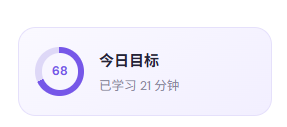

# 问题 01：侧边栏「今日目标」卡片

## 截图表现

- 卡片标题：今日目标
- 环形进度：68
- 辅助文案：已学习 21 分钟
- 位置：学习端桌面布局左侧边栏

## 当前代码情况

- 组件位于 `apps/web/src/components/PlatformShell.tsx`。
- 当前 `68` 和 `21 分钟` 都是静态文案。
- 环形进度位于 `apps/web/src/styles/layout.css`，当前使用固定的 `conic-gradient(... 68%, ...)`。
- 在屏幕宽度不超过 980px 时，当前响应式样式会隐藏整个今日目标卡片。

## 你的需求（已记录）

- 系统记录用户每天的学习时长。
- 用户可以自定义每天的学习目标时长。
- 已学习时长与目标时长的比例，用环形扇区和百分比呈现。
- 未达到目标时使用较浅的主色；超过目标后，环形圆使用更饱满、更深的主色。
- 用户第一次达到当日目标时，弹出一句鼓励文案。

## 建议补全的产品规则（待审批）

### 1. 有效学习时长

建议只在用户处于有效学习状态时计时：视频正在播放，或正在进行跟读录音；页面切到后台、浏览器失焦、播放暂停时立即停止。视频播放和录音同时发生时，使用同一只学习时钟，不能重复累计。

这比“进入学习页就开始计时”更可信，也能避免电脑休眠、切换标签页后突然增加大量学习时长。

### 2. 环形进度与文案

| 状态 | 环形表现 | 文案建议 |
| --- | --- | --- |
| 未开始 | 浅色底环 | 今天还未开始 |
| 1%～99% | 由浅至正常紫色的扇区 | 已学习 21 / 30 分钟 |
| 恰好达到 100% | 完整主色圆环 | 今日目标已完成 |
| 超过 100% | 仍为完整圆环，颜色更深、更饱满 | 超额完成 12 分钟 · 140% |

超过 100% 时不应让扇区继续绕第二圈；圆环保持完整，以颜色深浅区分超额状态，同时保留实际百分比和超额分钟数，信息更直观。

### 3. 完成鼓励弹窗

建议仅在当日进度**首次从未完成跨越到完成**时弹出一次。例如从 29 / 30 分钟累计到 30 分钟后触发；刷新页面、再次进入学习页和继续超额学习都不重复打扰。

弹窗可随机显示一条简短鼓励，例如：

- 今天的目标完成了，保持这个节奏。
- 很棒，30 分钟的专注已经积少成多。
- 目标达成。再练一句，或者带着成就感休息一下。

若用户只是把目标时长从较高值改低而立刻满足目标，建议更新进度但不触发庆祝弹窗，避免“修改设置”被误判为完成学习。

### 4. 目标设置与存储

建议首次默认目标为 30 分钟，在账户设置中提供常用选项（15、30、45、60 分钟）和自定义输入。目标改动后，今日比例即时重算。

当前学习端可以先把下列数据保存到浏览器本地：日期、目标分钟数、累计有效秒数、当日是否已弹出完成鼓励。按用户本地日期切换新的一天时创建新的记录；后续接入账户系统后，再同步到后端学习记录。

### 5. 交互与适配

- 卡片内始终同时展示百分比和分钟数，不能只靠颜色表达状态。
- 点击卡片可进入学习记录；点击设置入口可修改每日目标。
- 当前侧栏在 980px 以下会隐藏此卡片；建议在首页顶部提供紧凑版进度入口，让移动端用户也能看到当日目标。

## 本项目实现影响（仅评估）

- `apps/web/src/components/PlatformShell.tsx` 目前仅显示静态的 `68` 与 `21 分钟`，需要改为订阅学习目标状态。
- `apps/web/src/features/learning/PracticePage.tsx` 已有播放、暂停与录音状态，可以作为有效学习计时的触发入口。
- 当前播放界面是交互原型，尚未直接提供真实媒体的播放秒数事件；实施时需要增加一个会在播放、暂停、页面隐藏和卸载时正确结算的学习会话计时器。
- 环形图应通过 CSS 变量接收进度和状态颜色，不再把 `68%` 固定在样式中。

## 待确认

- 是否同意默认目标设为 30 分钟，并在设置中允许用户修改？
- 是否同意“有效学习”统计为实际播放和跟读录音时长，后台/暂停不计时？
- 完成弹窗采用“每天首次达成一次”的规则是否合适？

## 试做版状态

- 已在隔离分支 `codex/daily-goal-prototype` 完成学习端试做，不影响主项目 `master`。
- 支持设置每日目标、记录前台播放与跟读录音时长、按比例显示环形进度，并在每日首次达成目标时显示鼓励弹窗。
- 本地验证已覆盖 53% 进度与首次达成弹窗；类型检查、24 项测试和生产构建均通过。
